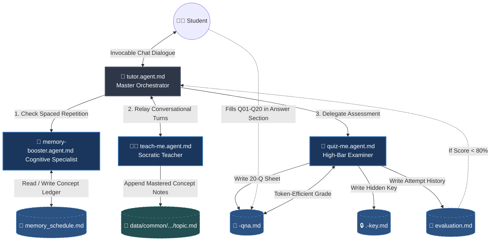
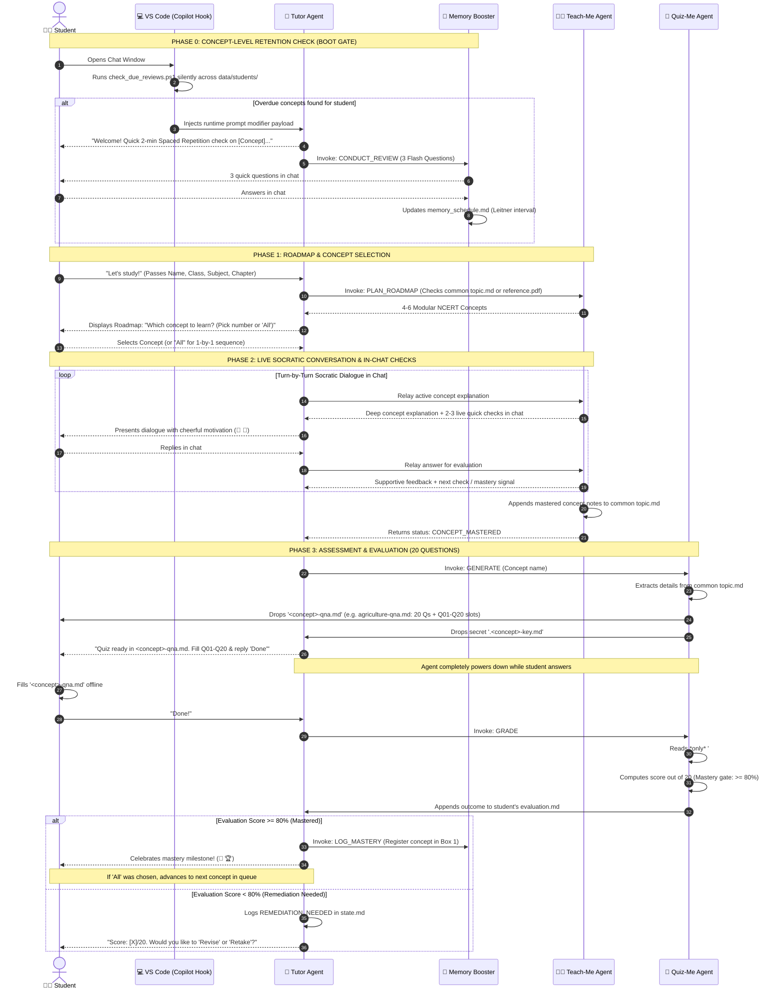

# CBSE AI Tutor

This repository houses a production-ready, highly token-efficient multi-agent architecture built for **GitHub Copilot** (or any agentic markdown runtime workspace). The platform facilitates an end-to-end learning lifecycle for CBSE curriculum students, balancing immediate short-term concept mastery with long-term memory retention through structured, automated agent hand-offs.

---

## 🏗️ System Architecture & Orchestration (Hub & Spoke)

The system partitions workflows across four highly specialized agents under a centralized **Hub & Spoke** model. The student interacts exclusively with `@tutor`. All sub-agents communicate via strict pseudo-JSON parameters passed through model context protocol instructions.



---

## ⏱️ Execution Protocol Timeline

This sequence diagram illustrates the lifecycle of an interactive learning block, tracing conversational teaching, in-chat quick checks, single-file assessment, and concept-level retention.



---

## 🎯 Key Design Patterns & Teaching Protocols

* **Hub-and-Spoke Invocability:** The student only needs to converse with `@tutor`. Subagents (`teach-me`, `quiz-me`, `memory-booster`) are specialized workers orchestrated by `tutor` behind the scenes.
* **Live In-Chat Socratic Dialogue:** Teaching happens strictly in conversation with the student in the chat window. No offline lesson markdown files (such as `lesson.md`) are dumped on the student.
* **Formative In-Chat Quick Checks:** During instruction, `teach-me` poses 2–3 quick check questions right in the chat to ensure attention and tracking before moving to summative testing.
* **Cheerful & Supportive Persona:** Uses motivating language and emojis (🌟, 🚀, 👏). If an answer is incorrect, it calls it out directly but in a positive, constructive manner with guiding hints.
* **Dynamic Concept-Specific Assessment (`<concept>-qna.md`):** Automatically named after the active concept (e.g., `agriculture-qna.md`, `linear-eq-qna.md`, `atmospheric-layers-qna.md`). Eliminates file switching with questions at top and `Q01:`–`Q20:` slots at bottom.
* **Token-Saving Grading:** `quiz-me` reads only from `## Student Answers` downwards and matches against `.<concept>-key.md`, avoiding re-tokenizing large question prompts.
* **Concept-Level Spaced Repetition:** `memory-booster` schedules and evaluates 3-question flash checks at the granular concept level using the Leitner box interval system (1d ➔ 3d ➔ 7d ➔ 14d).

---

## 🧭 Repository Blueprint & Navigation Links

Select any of the components listed below to jump directly to its definition or script architecture:

### 🤖 Core Workspace Agents
* [🤖 Master Orchestrator](.github/agents/tutor.agent.md) — Manages the state pipeline, coordinates sub-agents, and handles student chat.
* [👩‍🏫 Socratic Teacher](.github/agents/teach-me.agent.md) — Teaches concepts step-by-step in chat with analogies, NCERT grounding, and 2-3 quick checks.
* [📝 High-Bar Examiner](.github/agents/quiz-me.agent.md) — Generates 20-question dynamic sheets (`<concept>-qna.md`) and grades against hidden keys.
* [🧠 Cognitive Memory Specialist](.github/agents/memory-booster.agent.md) — Manages concept-level retention intervals and conducts in-chat flash reviews.

### 🛠️ VS Code Automated Lifecycle Hooks
* [📁 Hook Matrix Properties](.github/hooks/hooks.json) — Registers workspace activation directives to bind session launch triggers.
* [⚙️ Multi-Student PowerShell Verification Script](.github/hooks/scripts/check_due_reviews.ps1) — Aggregates and checks spaced repetition dates across all student subfolders dynamically.

### 📂 Directory Architecture
```text
your-repository/
└── data/
    ├── common/                               # SHARED CANONICAL REPOSITORY
    │   └── <class>/                          # E.g., Class 9, Class 10
    │       └── <subject>/                    # E.g., Science, Geography
    │           └── <topic>/                  # E.g., Atmosphere and Climate
    │               ├── reference.pdf         # Chapter or Subject textbook PDF (if provided)
    │               └── topic.md              # Shared canonical concept notes & syllabus roadmap
    │
    └── students/                             # STUDENT SPECIFIC
        └── <student_name>/                   # E.g., Amey, Abir
            ├── memory_schedule.md            # Spaced repetition tracker (Boxes 1-4, concept-level)
            └── <class>/
                └── <subject>/
                    └── <topic>/
                        ├── state.md          # Personal queue & lifecycle ledger
                        ├── <concept>-qna.md  # E.g. agriculture-qna.md (20 questions + Q01-Q20 slots)
                        ├── .<concept>-key.md # Secure grading criteria
                        └── evaluation.md     # Attempt history table & score breakdown
```
