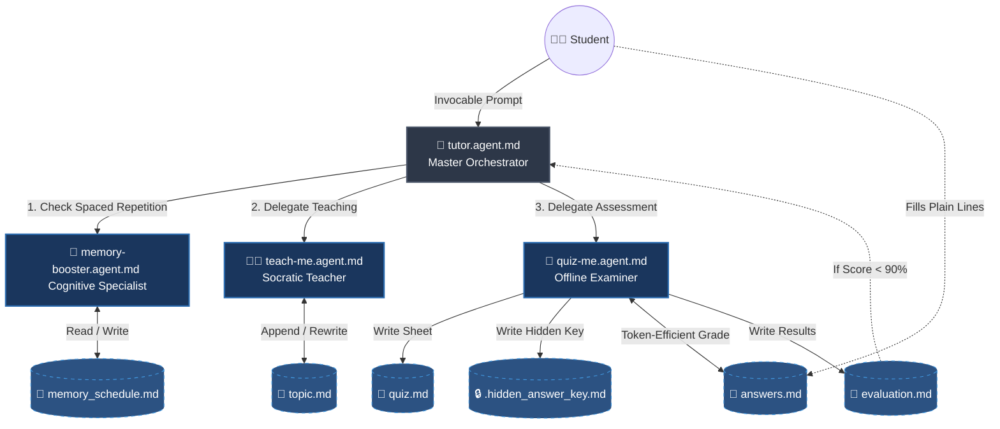
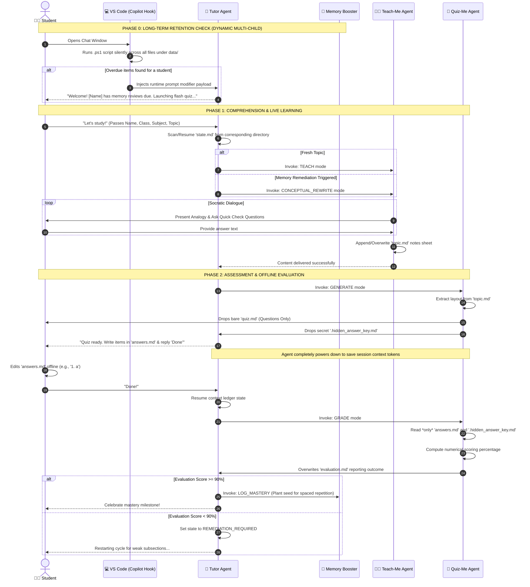

# CBSE AI Tuition Agentic Workspace

This repository houses a production-ready, highly token-efficient multi-agent architecture built for **GitHub Copilot** (or any agentic markdown runtime workspace). The platform facilitates an end-to-end learning lifecycle for CBSE curriculum students, balancing immediate short-term concept mastery with long-term memory retention through structured, automated agent hand-offs.

---

## 🏗️ System Architecture & Orchestration

The system partitions workflows across four highly specialized agents. All sub-agents communicate via strict pseudo-JSON parameters passed through model context protocol instructions.



---

## ⏱️ Execution Protocol Timeline

This sequence diagram illustrates the lifecycle of a learning block, explicitly tracing when agents pause, hand off control, and use offline files to compress token expenses.



---

## 🎯 Key Token Optimization Design Patterns

* **Plain-Text Assessment Boundary:** The grading sequence ignores the heavy markdown payload of `quiz.md`. It isolates evaluations exclusively by matching `answers.md` alongside the hidden target values, keeping token constraints minimal during execution steps.
* **Plain Lines Input Formatting:** Students respond to questions or short answers using plain text lines (e.g., `1. a` or `2. Answer text`) directly inside the lightweight text file, saving massive context data overhead.
* **Append-Only Ledger Continuity:** `state.md` avoids write conflicts and structural parsing errors by continually writing transactions sequentially to the bottom of the page. The core orchestrator parses the file via trailing configurations to seamlessly restore context states across broken sessions.

---

## 🧭 Repository Blueprint & Navigation Links

Select any of the components listed below to jump directly to its definition or script architecture in your workspace folder hierarchy:

### 🤖 Core Workspace Agents
* [🤖 Master Orchestrator](.github/agents/tutor.agent.md) — Manages the state pipeline and targets student folder logic.
* [👩‍🏫 Socratic Teacher](.github/agents/teach-me.agent.md) — Explains subtopics incrementally with customized real-world analogies.
* [📝 Offline Examiner](.github/agents/quiz-me.agent.md) — Generates assessment criteria blueprints and scores raw student outputs.
* [🧠 Cognitive Memory Specialist](.github/agents/memory-booster.agent.md) — Logs learning milestones and tracks long-term retention gates.

### 🛠️ VS Code Automated Lifecycle Hooks
* [📁 Hook Matrix Properties](.github/hooks/hooks.json) — Registers workspace activation directives to bind session launch triggers.
* [⚙️ Multi-Student PowerShell Verification Script](.github/hooks/scripts/check_due_reviews.ps1) — Aggregates and checks spaced repetition dates across all dynamic student subfolders locally.

### 📂 Isolated Folder Data Footprint
```text
your-repository/
└── data/
    └── <class>/                # E.g., Class 9, Class 10
        └── <student_name>/     # Dynamically handles multi-child sibling entries
            ├── [memory_schedule.md]   # Central Spaced Repetition matrix for this child
            └── <subject>/
                └── <topic>/
                    ├── state.md       # Append-only session ledger
                    ├── topic.md       # Socratic reference concepts & analogies
                    ├── quiz.md        # Raw student test sheet
                    ├── answers.md     # Lightweight text file for responses
                    ├── evaluation.md  # Detailed itemized performance maps
                    └── .hidden_answer_key.md # Enforced secure valuation criteria
```
