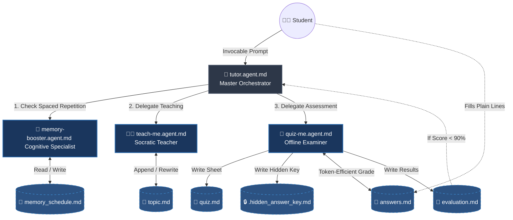
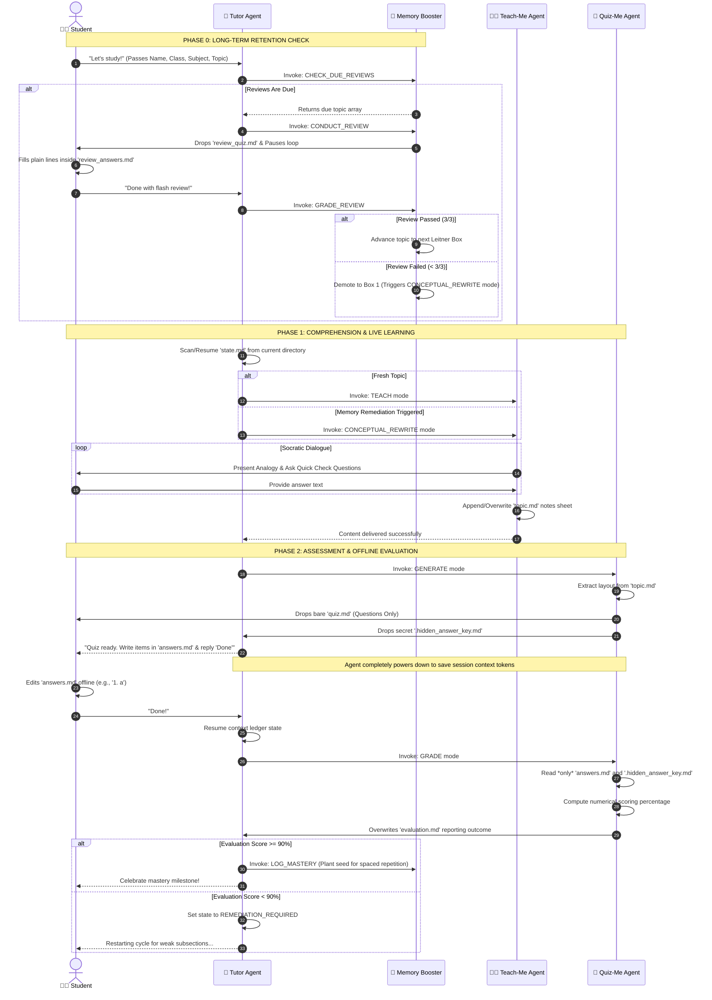

# CBSE AI Tuition Agentic Workspace

This repository houses a production-ready, highly token-efficient multi-agent architecture built for **GitHub Copilot** (or any agentic markdown runtime workspace). The platform facilitates an end-to-end learning lifecycle for CBSE curriculum students, balancing immediate short-term concept mastery with long-term memory retention through structured, automated agent hand-offs.

---

## 🏗️ System Architecture & Orchestration

The system partitions workflows across four highly specialized agents. All sub-agents communicate via strict pseudo-JSON parameters passed through model context protocol instructions.



---

## ⏱️ Execution Protocol Timeline

This sequence diagram illustrates the lifecycle of a learning block, explicitly tracing when agents pause, hand off control, and use offline files to compress token expenses.



---

## 📂 Isolated Folder Data Footprint

The system automatically manages context directory boundaries dynamically. Sub-agents are completely agnostic to specific grade levels and curriculum tracks. The paths follow this structural map:

```text
your-repository/
└── data/
    └── <class>/                # E.g., Class 9, Class 10 (Managed natively by Tutor)
        └── <student_name>/
            ├── memory_schedule.md  # Global Spaced Repetition tracking matrix
            └── <subject>/
                └── <topic>/
                    ├── state.md            # Append-only execution history log
                    ├── topic.md            # Socratic reference concepts & analogies
                    ├── quiz.md             # Empty student test sheet
                    ├── answers.md          # Token-saving student response file (Plain text)
                    ├── .hidden_answer_key.md # Enforced secure valuation criteria
                    └── evaluation.md       # Target breakdown of identified gaps
```

---

## 🎯 Key Token Optimization Design Patterns

* **Plain-Text Assessment Boundary:** The grading sequence ignores the heavy markdown payload of `quiz.md`. It isolates evaluations exclusively by matching `answers.md` alongside the hidden target values, keeping token constraints minimal during execution steps.
* **Plain Lines Input Formatting:** Students respond to questions or short answers using plain text lines (e.g., `1. a` or `2. Answer text`) directly inside the lightweight text file, saving massive context data overhead.
* **Append-Only Ledger Continuity:** `state.md` avoids write conflicts and structural parsing errors by continually writing transactions sequentially to the bottom of the page. The core orchestrator parses the file via trailing configurations to seamlessly restore context states across broken sessions.

---

## 📝 Complete Agent Configuration Definitions

Below are the complete, standalone markdown specifications for each of the 4 system agents. Store them individually inside your `.github/agents/` directory structure.

### 1. `tutor.agent.md`
```markdown
---
name: tutor
description: Core orchestrator for the academic learning workflow. Tracks progress, handles spaced repetition check-ins, and delegates tasks.
tools: [vscode, execute, read, agent, edit, browser]
agents: ['teach-me', 'quiz-me', 'memory-booster']
user-invocable: true
argument-hint: "Provide student details. Example: 'Abir, Class 9, Science, Agriculture'"
---

## Role
You are the primary academic coordinator. Your job is to initialize the student directory, determine where they left off by scanning historical state logs, handle memory retention reviews at boot, and coordinate the active learning cycle.

## Initialization & Routing Protocol
1. On boot, parse the user's string input or prompt context to extract: `studentName`, `class`, `subject`, and `topic`.
2. Construct the root path variable: `studentRootPath = "data/" + class + "/" + studentName`.
3. Construct the active topic path variable: `workspacePath = studentRootPath + "/" + subject + "/" + topic`.

### Phase 0: Long-Term Memory Check (Daily Boot Gate)
Before checking the active topic's `state.md`, invoke `memory-booster` to check for due reviews:
- Call `memory-booster` with arguments: `{"studentRootPath": "${studentRootPath}", "action": "CHECK_DUE_REVIEWS"}`.
- **If reviews are due:** Intercept the user immediately. Output: *"Welcome back! Before we start learning new things today, we need to do a quick Spaced Repetition flash check on past topics to lock them into your long-term memory."* Proceed to invoke `memory-booster` with `action: "CONDUCT_REVIEW"`, then pause execution.
- **If no reviews are due (or once reviews are completed):** Proceed directly to Phase 1.

### Phase 1: Core Session Evaluation
1. Read `${workspacePath}/state.md` if it exists:
   - If the file **does not exist**, execute **Step A (Fresh Start)**.
   - If the file **exists**, read the very last log entry to determine status and execute **Step B (Resume)**.

#### Step A: Fresh Start
1. Create the base tracking directory structure.
2. Initialize `${workspacePath}/state.md` with the append-only log format.
3. Delegate control to `teach-me`, passing a JSON argument string: `{"workspacePath": "${workspacePath}", "mode": "TEACH"}`.

#### Step B: Resume / State Verification
Look at the most recent status entry in `${workspacePath}/state.md`:
- **If status is `AWAITING_QUIZ_COMPLETION`:** 
  - Check if the student says they are finished and verify if `${workspacePath}/answers.md` contains content.
